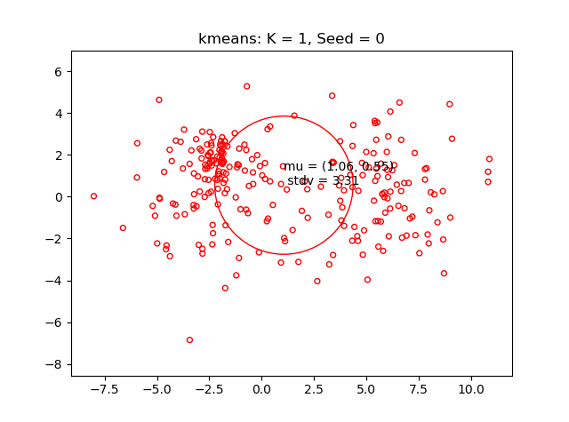
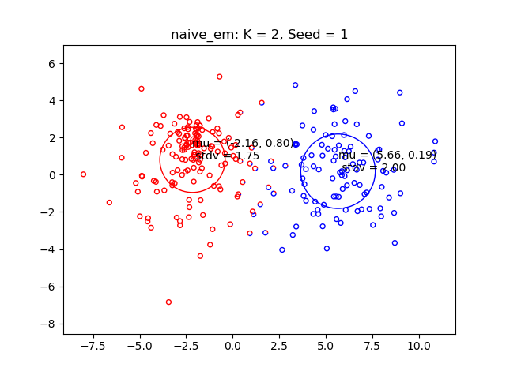
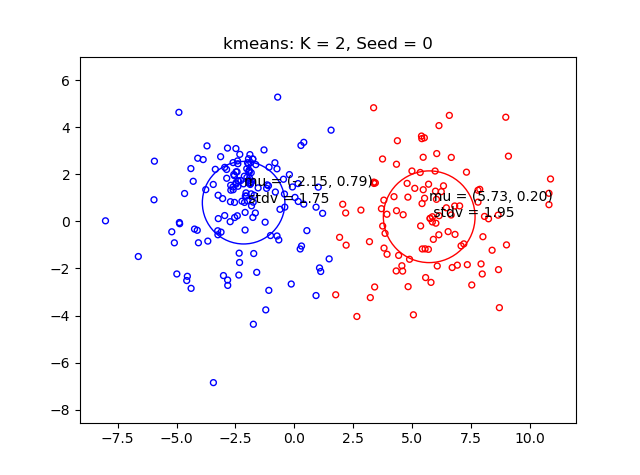
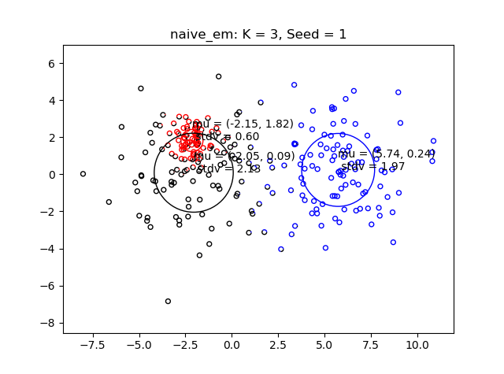
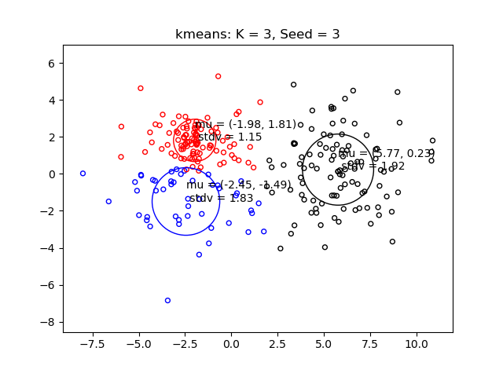
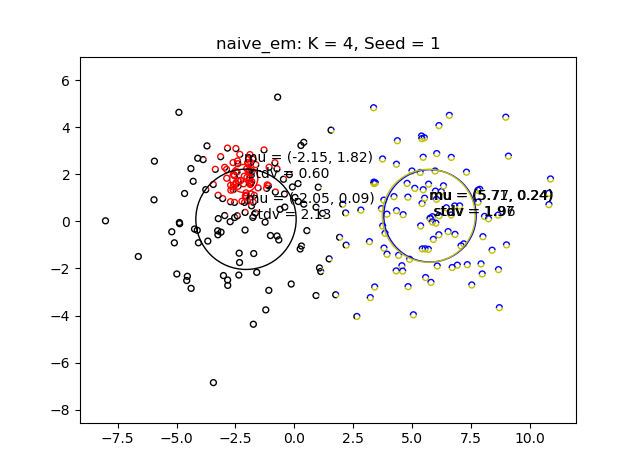
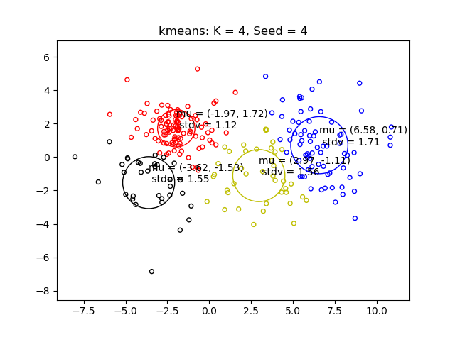

# netflix_recommender

## Introduction

This project is part of the course [Machine Learning with Python: from Linear Models to Deep Learning](https://www.edx.org/course/machine-learning-with-python-from-linear-models-to).

For this project, we have a data matrix containing the movie ratings made by users (the matrix was extracted from a much larger Netflix database).

But the problem is that any particular user has rated only a small fraction of the movies which means that the data matrix is only partially filled.

The goal of this project is to predict all the remaining entries of the matrix by building a mixture model for collaborative filtering.

## Assumption

The rating profile of each user is seen as a sample extracted from a mixture model.

## Steps

- Use the Expectation Maximization (EM) algorithm to estimate a mixture from a partially observed rating matrix

- The EM algorithm proceeds by iteratively assigning (softly) users to types (E-step) and subsequently re-estimating the Gaussians associated with each type (M-step). 

- Once we have the mixture, we can use it to predict values for all the missing entries in the data matrix.

## Files

- **main.py** main file to start the project

- **kmeans.py** baseline using the K-means algorithm

- **naive_em.py** first version of the EM algorithm

- **em.py** mixture model for collaborative filtering

- **common.py** common functions for all models

- **test.py** test defferent implementation of EM and test cases

- **toy_data.txt** a 2D dataset to play with

- **netflix_incomplete.txt** the netflix dataset with missing entries that needs to be completed

- **netflix_complete.txt** the netflix dataset with missing entries completed

- **test_incomplete.txt** a test dataset with MIT implementation

- **test_complete.txt** a test dataset with MIT implementation

- **test_solutions.txt** a test dataset with MIT implementation

## Result

### In the case K=1, the mixture parameters and point assignments are the same for both methods

### In the case K=2, both methods have simililar parameters and point assignments

### In the case K=3, the k-means solution accounts for point density better than EM

### In the case K=4, the k-means solution equally spaces the clusters to minimize distortion cost

